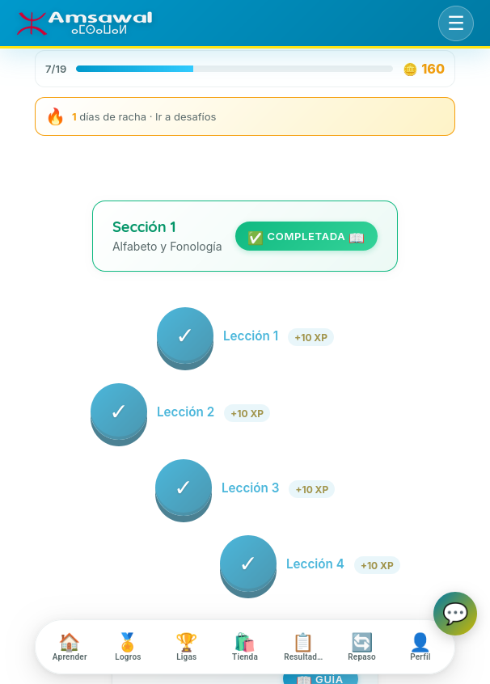
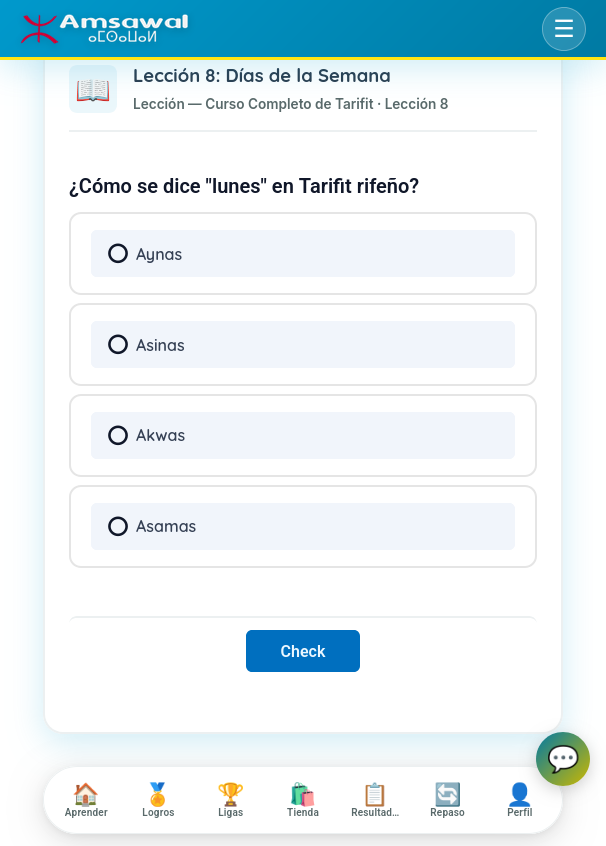
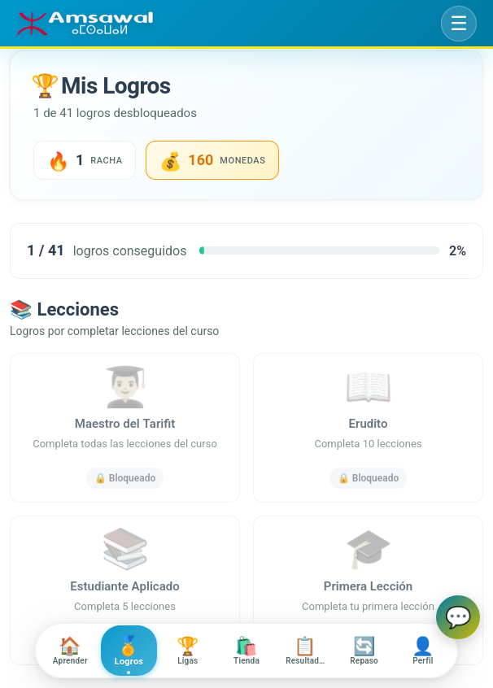
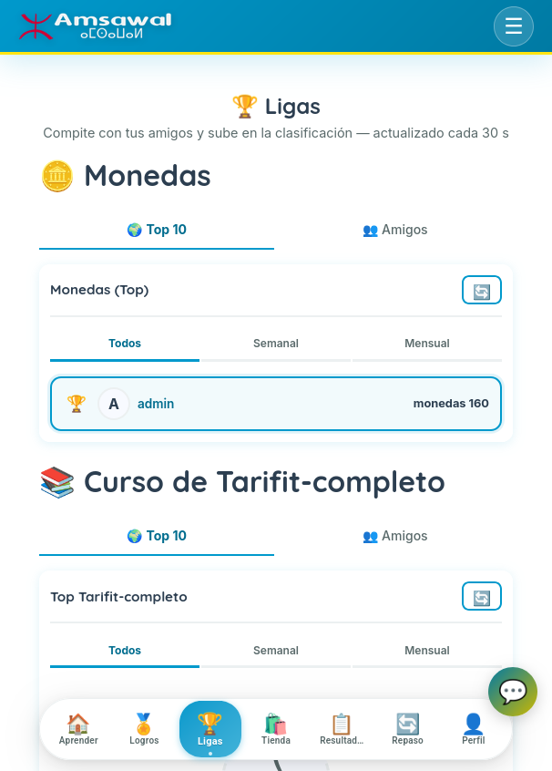
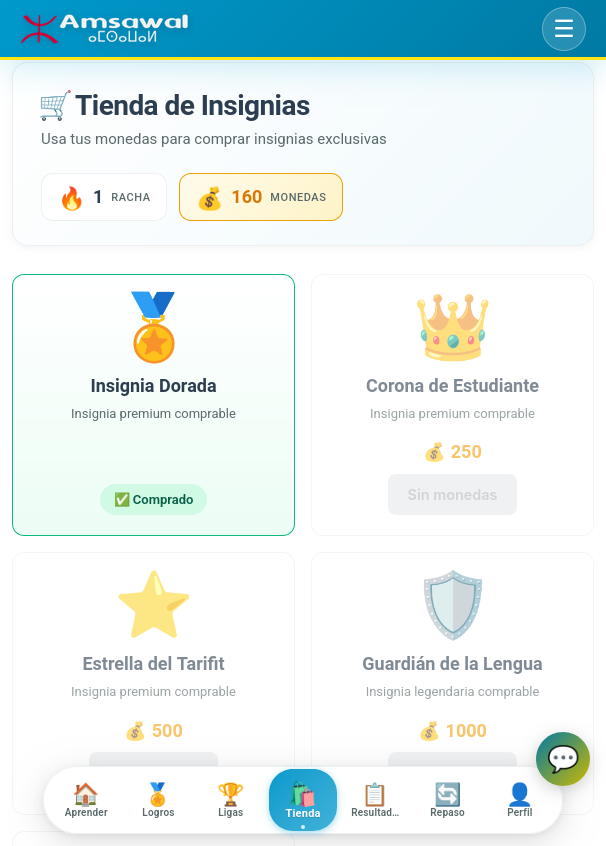
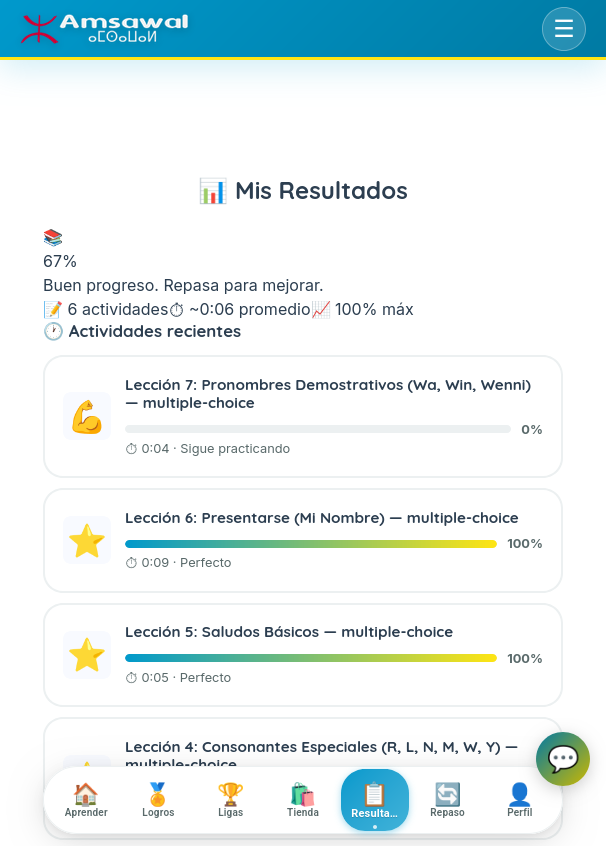
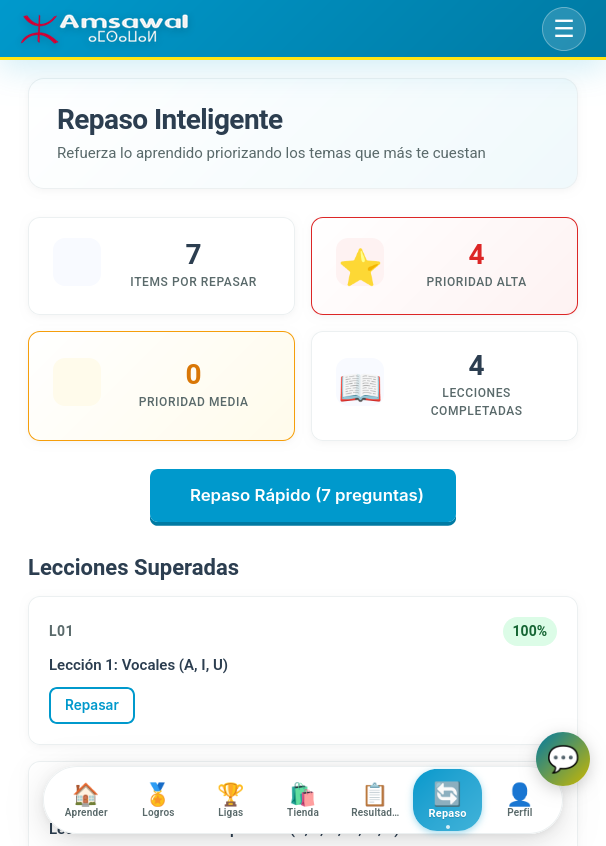
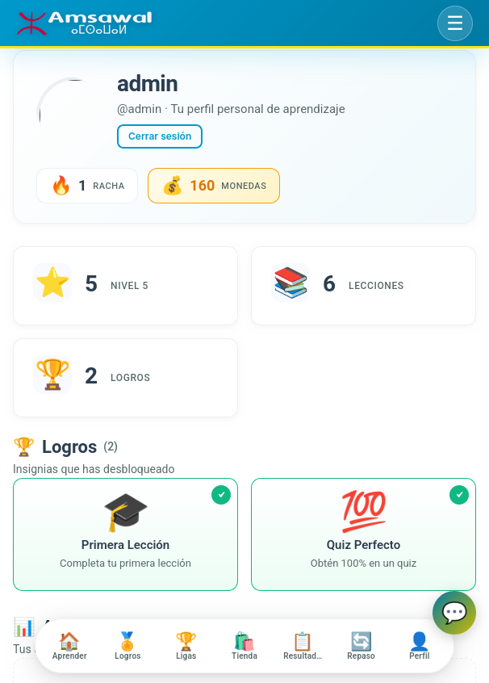

# WP Amsawal - Tamazight Learning Platform

[](LICENSE)
[](https://wordpress.org)
[](https://php.net)
[](https://www.w3.org/WAI/WCAG21/quickref/)

A Duolingo-style educational platform for learning **Tamazight (Tarifit/Rif)** - the Amazigh language of North Africa.

## Features

### Learning Experience
- **Interactive Learning Path** - Duolingo-style node-based progression
- **H5P Activities** - 10+ activity types (flashcards, quizzes, dictation, drag-drop, etc.)
- **AI-Powered Content** - Auto-generated exercises using LLM content pipeline
- **Adaptive Testing** - Difficulty adjusts to learner performance
- **Virtual Tutor** - AI chat assistant for questions and guidance

### Gamification
- **XP & Levels** - Earn experience points and level up
- **Streaks** - Daily practice tracking with freeze options
- **Achievements** - Unlock badges for milestones
- **Leaderboards** - Compete in weekly leagues
- **Quests** - Daily challenges for bonus rewards

### Accessibility
- **WCAG AAA** - 7.1:1 contrast ratio for all text
- **Keyboard Navigation** - Full keyboard accessibility
- **Screen Reader Support** - ARIA labels and live regions
- **High Contrast Mode** - Enhanced visibility
- **Reduced Motion** - Respects user preferences
- **Focus Indicators** - Clear focus states on all interactive elements

### Performance
- **Critical CSS** - Inline above-the-fold styles
- **Lazy Loading** - Images load on demand
- **Service Worker** - Offline support
- **Cache Optimization** - Browser and server-side caching
- **Resource Hints** - Preconnect and prefetch

### Technology
- **WordPress Plugin** - Extends WordPress with custom functionality
- **H5P Integration** - Interactive content framework
- **AI Backend** - OpenAI-compatible (ModelScope Qwen3-Next-80B, configurable)
- **Vanilla JavaScript** - No jQuery dependency
- **Modular CSS** - Component-based architecture
- **Docker Support** - Easy local development

## Screenshots

| Learning path | Lesson | Achievements |
|---------------|--------|--------------|
|  |  |  |

| Leagues | Shop | Results | Review | Profile |
|---------|------|---------|--------|---------|
|  |  |  |  |  |

## Quick Start

### Prerequisites
- Docker & Docker Compose
- Verified on WordPress 7.0 / PHP 8.2 / MySQL 8.0

### Installation
```bash
# Clone repository
git clone https://github.com/enacimie/wp-amsawal-dev.git
cd wp-amsawal-dev

# Configure AI backend (copy and edit)
cp .env.example .env

# Start Docker environment
docker compose up -d

# Access site
open http://localhost:8080

# Admin panel
open http://localhost:8080/wp-admin
```

### Development
```bash
# View logs
docker compose logs -f wordpress

# Run tests
bash tests/run-tests.sh

# Make changes
# 1. Edit files in project directory
# 2. Copy to Docker:
docker compose cp <file> wordpress:/var/www/html/wp-content/plugins/wp-amsawal/
# 3. Flush cache:
docker compose exec -T wordpress bash -c 'cd /var/www/html && php -r "define("WP_USE_THEMES", false); require "wp-load.php"; wp_cache_flush();"'
```

## Documentation

- [Architecture Specification](docs/ARCHITECTURE-SPECIFICATION.md) - Event model, subsystem mapping, AI subsystem catalog
- [Reproducibility & Deployment](docs/REPRODUCIBILITY.md) - Verified environment, setup, data model
- [Component Documentation](COMPONENTS.md) - Design tokens, components, accessibility
- [API Documentation](API.md) - Endpoints, hooks, database schema
- [Contributing Guide](CONTRIBUTING.md) - How to contribute
- [Changelog](CHANGELOG.md) - Version history
- [Roadmap](ROADMAP.md) - Project roadmap

## Testing

```bash
# Run all tests
bash tests/run-tests.sh

# Individual tests
php tests/test-ui-ux.php           # Unit tests
php tests/test-integration.php     # Integration tests
php tests/test-performance-budget.php  # Performance budget
bash tests/visual-regression.sh    # Visual regression (requires Chrome)
bash tests/accessibility-audit.sh  # Accessibility audit (requires pa11y)
```

## Browser Support

| Browser | Version |
|---------|---------|
| Chrome/Edge | 90+ |
| Firefox | 88+ |
| Safari | 14+ |
| Mobile Safari iOS | 14+ |
| Chrome Android | 90+ |

## License

[GNU General Public License v3.0](LICENSE) - Amsawal Project

## Acknowledgments

- **Amazigh Culture** - Inspired by Atlas Mountains and Tifinagh script
- **Duolingo** - UI/UX inspiration for learning path design
- **H5P** - Interactive content framework
- **GamiPress / BuddyPress** - Gamification and social components
- **ModelScope / Qwen** - AI inference backend

## Contact

Project: [GitHub](https://github.com/enacimie/wp-amsawal-dev)
