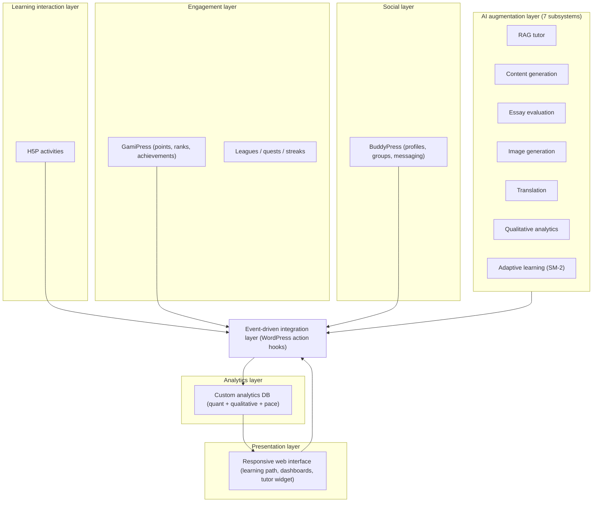
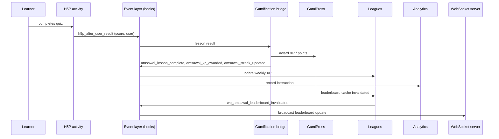

# Amsawal — Architectural Specification and Implementation Evidence

> Companion technical document to the manuscript *"An AI-Augmented Open
> Architecture for Gamified and Adaptive Learning Platforms"* (IEEE TLT).
> This document maps the event model, subsystem integration, and the seven
> AI subsystems to their implementation in the `wp-amsawal-*.php` codebase.

## 1. Coordination mechanism

Amsawal coordinates subsystems through the **WordPress action-hook
mechanism** (`do_action()` / `add_action()`), which plays the role of a
shared event bus. Learner actions and internal subsystem state changes are
published as named actions; any number of subscribers may observe them and
respond independently. There is no shared database contract between
subsystems: application-level coordination happens primarily through the
named actions listed in Section 2, complemented by direct subscriptions to
selected native plugin hooks (Section 4) and AJAX endpoints for
request/response interaction.

This is deliberately a *lightweight coordination pattern* built on an
established hook mechanism rather than a full message-broker infrastructure
(no durable queues, no delivery guarantees, no ordering semantics). The
contribution is the *coordination model itself* — a documented, shared set
of events through which learning, gamification, social, analytics, and AI
components interact without direct dependencies.

### 1.1 Layered architecture

### 1.2 Lesson-completion event flow

## 2. Event catalog

Producers fire the following application events (all `do_action()` calls
located in the plugin codebase).

| # | Event | Payload fields | Producer (file) | Subscribers / effect |
|---|-------|----------------|-----------------|----------------------|
| 1 | `amsawal_lesson_complete` | `user_id`, `is_repeat` (0/1) | `wp-amsawal-gamipress-bridge.php`, `wp-amsawal-router.php` | Achievements (lesson-count), Analytics (completion tracking), Challenges, Data collection (behavior log) |
| 2 | `amsawal_activity_tracked` | `user_id`, `activity_type`, `meta{ item_text, score, is_repeat }` | `wp-amsawal-gamipress-bridge.php`, `wp-amsawal-router.php` | Achievements (generic triggers) |
| 3 | `amsawal_level_up` | `user_id`, `new_level` | `wp-amsawal-gamipress-bridge.php`, `wp-amsawal-router.php` | Analytics (rank change), Data collection (behavior log) |
| 4 | `amsawal_section_complete` | `user_id`, `section_num` | `wp-amsawal-gamipress-bridge.php` | Achievements (section badges) |
| 5 | `amsawal_streak_updated` | `user_id`, `streak_days` | `wp-amsawal-gamipress-bridge.php` | Achievements (streak milestones) |
| 6 | `amsawal_mastery_updated` | `user_id` | `wp-amsawal-gamipress-bridge.php` | Achievements (mastery count) |
| 7 | `amsawal_lesson_complete_extended` | `user_id`, `is_repeat`, `score_pct`, `duration`, `timestamp` | `wp-amsawal-gamipress-bridge.php` | Achievements (time-of-day / speed) |
| 8 | `amsawal_perfect_score` | `user_id` | `wp-amsawal-gamipress-bridge.php`, `wp-amsawal-achievements-system.php` | Achievements (perfectionist) |
| 9 | `amsawal_xp_awarded` | `user_id`, `xp_amount`, `reason` | `wp-amsawal-router.php` | Analytics (XP event), Challenges (XP quests) |
| 10 | `amsawal_achievement_earned` | `user_id`, `achievement_id`, `slug`, `reason` | `wp-amsawal-achievements-system.php` | (notification/webhook hook) |
| 11 | `amsawal_achievement_purchased` | `user_id`, `achievement_id`, `data` | `wp-amsawal-achievements-system.php` | (shop audit hook) |
| 12 | `amsawal_lesson_unlocked_with_coins` | `user_id`, `lesson_id`, `cost` | `wp-amsawal-achievements-system.php` | (audit hook) |
| 13 | `amsawal_league_tier_reached` | `user_id`, `tier` | `wp-amsawal-leagues.php` | Achievements (league tiers) |
| 14 | `wp_amsawal_ai_query_complete` | `prompt`, `response`, `user_id`, `context{ model, backend, url }` | `wp-amsawal-ai.php` | Data collection (AI interaction analytics) |
| 15 | `wp_amsawal_leaderboard_invalidated` | `type`, `[]` | `wp-amsawal-leaderboard.php` | WebSocket server (real-time broadcast) |
| 16 | `amsawal_behavior_tracked` | `event_type`, `user_id`, `metadata` | `wp-amsawal-data-collection.php` | (post-write notification hook) |
| 17 | `amsawal_sync_{action}` | `data`, `user_id` | `wp-amsawal-offline.php` | Offline queue replay |
| 18 | `amsawal_lesson_start` | `user_id`, `lesson_id` (post ID) | `wp-amsawal-h5p.php` | Data collection (behavior log) |
| 19 | `amsawal_quiz_start` | `user_id`, `h5p_content_id` | `wp-amsawal-h5p.php` | Data collection (behavior log) |
| 20 | `amsawal_quiz_complete` | `user_id`, `h5p_content_id`, `score` | `wp-amsawal-gamipress-bridge.php` | Data collection (behavior log) |
| 21 | `wp_amsawal_essay_evaluated` | `user_id`, `essay_text`, `evaluation{ overall_score, grammar_score, vocabulary_score, structure_score, feedback }` | `wp-amsawal-essay-evaluation.php` | Data collection (AI assessment analytics) |

In addition, the data-collection subsystem subscribes directly to the
upstream plugin hooks to capture raw activity (Section 4).

## 3. Subsystem ↔ event mapping

| Subsystem | Emits | Consumes |
|-----------|-------|----------|
| Gamification bridge | `lesson_complete`, `activity_tracked`, `level_up`, `section_complete`, `streak_updated`, `mastery_updated`, `lesson_complete_extended`, `perfect_score`, `quiz_complete` | H5P results (`h5p_alter_user_result`) |
| Achievements | `achievement_earned`, `achievement_purchased`, `lesson_unlocked_with_coins`, `perfect_score` | `lesson_complete`, `section_complete`, `streak_updated`, `league_tier_reached`, `mastery_updated`, `lesson_complete_extended`, `activity_tracked`, `friends_friendship_accepted` (BuddyPress) |
| Analytics / data collection | `behavior_tracked` | H5P hooks, GamiPress hooks, BuddyPress hooks, `ai_query_complete`, `essay_evaluated` |
| Leagues | `league_tier_reached` | (weekly cron `wp_amsawal_league_weekly_reset`) |
| Leaderboard | `leaderboard_invalidated` | GamiPress points |
| WebSocket server | — | `leaderboard_invalidated` |
| AI layer | `ai_query_complete` | lesson-context requests |

## 4. Raw data sources (direct plugin hooks)

The data-collection layer captures activity from six sources by subscribing
to the corresponding native hooks (this is how the platform ingests data
without modifying the source plugins):

1. **H5P** — `h5p_alter_user_result` (authoritative result-save hook)
2. **GamiPress** — `gamipress_award_achievement`, `gamipress_update_user_points`,
   `gamipress_update_user_rank`
3. **BuddyPress** — `bp_activity_posted_update`, `groups_join_group`,
   `friends_friendship_accepted`
4. **AI subsystems** — `wp_amsawal_ai_query_complete`, `wp_amsawal_essay_evaluated`
5. **WebSocket** — connection/message events
6. **UI** — navigation and feature-usage behavior tracking
   (`amsawal_track_behavior`)

## 5. AI subsystems

Seven AI subsystems are implemented as independent modules. Each is a
dedicated file and communicates with the platform through the shared event
mechanism and/or AJAX endpoints; none requires modifying H5P, GamiPress, or
BuddyPress core.

| # | Subsystem | File(s) | Input | Output | Integration |
|---|-----------|---------|-------|--------|-------------|
| 1 | RAG tutor | `wp-amsawal-ai-tutor.php`, `wp-amsawal-ai.php` | User question + lesson context (vocabulary, grammar, examples) | Tutor reply (validated) | AJAX `wp_amsawal_tutor_ask`; emits `wp_amsawal_ai_query_complete` |
| 2 | Content generation | `wp-amsawal-ai.php`, `wp-amsawal-ai-schemas.php` | Lesson metadata (vocab, objectives, grammar, level) | H5P content (12 types) | Prompt → LLM → schema validation → H5P instantiation |
| 3 | Essay evaluation | `wp-amsawal-essay-evaluation.php` | Learner-written text | 3-dimension scores + feedback | AJAX `amsawal_evaluate_essay` |
| 4 | Image generation | `wp-amsawal-modelscope-images.php` | Word/meaning | Contextual illustration (Z-Image-Turbo) | Batch generation for flashcards |
| 5 | Translation | `wp-amsawal-translate.php` | Course content + target language | Translated content (6 languages) | AJAX `wp_amsawal_translate_post/course` |
| 6 | Qualitative analytics | `wp-amsawal-qualitative-analysis.php` | Aggregated learner metrics | Natural-language pedagogical reports | AJAX `wp_amsawal_run_qualitative_analysis` |
| 7 | Adaptive learning | `wp-amsawal-adaptive.php` (+ `wp-amsawal-router.php`) | Item interaction results | SM-2 review schedule + mastery scores | `wp_amsawal_update_mastery`, `wp_amsawal_update_sm2` |

## 6. Result pipeline and xAPI scope

H5P is capable of producing xAPI statements; however, the current Amsawal
pipeline captures activity outcomes through H5P's native result hook
(`h5p_alter_user_result`) and routes selected results to the internal
analytics database. This is an **internal result-ingestion pipeline**, not
external interoperability: the current deployment does not emit standard
xAPI statements to an external Learning Record Store (LRS), and no
integration with Moodle, Open edX, Canvas, Sakai, or a third-party LRS is
claimed. Extending the pipeline to emit standard xAPI statements to an
external LRS is future work.

## 7. Extensibility evidence

The seven AI subsystems (Section 5) plus the custom subsystems (WebSocket
server, leagues, quests, notifications, versioning, health monitoring) were
added as independent modules. Integration is performed through event
subscriptions, direct native-hook subscriptions, and AJAX endpoints — no
changes to the internal code of H5P, GamiPress, or BuddyPress were required.

*One qualified exception:* the platform applies a runtime filter
(`h5p_get_content_settings`, `wp-amsawal-ai.php`) that injects the
`embedType` field into H5P's integration settings, because the upstream H5P
plugin omits it and `h5p.js` requires it to render content in `div` mode.
This is hook-based and requires no source modification. A defensive,
optional deployment script (`bin/patch-h5p-embedtype.php`) can additionally
patch `class-h5p-plugin.php` at install time; it is not required when the
runtime filter is active.

*Note: quantitative extensibility metrics (integration-time measurement,
module replacement experiments, dependency-graph analysis) remain future work.*

## 8. Privacy / data handling

The platform processes learner interaction data, AI queries, essay
submissions, and analytics events. In the current deployment these data are
stored in the platform database (WordPress tables plus custom
`amsawal_*` analytics tables) and access is restricted to authorized
instructors/administrators. Learner data used in the usability evaluation
were handled anonymously. A comprehensive privacy and threat model for
large-scale, multi-institution deployment remains future work.
